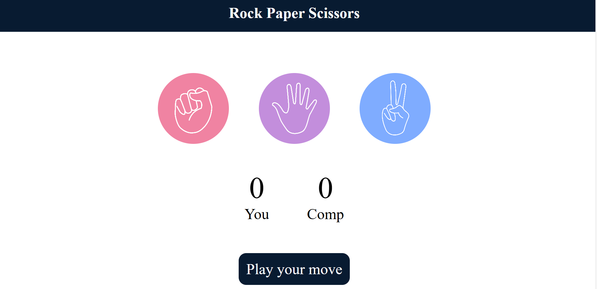

# Rock Paper Scissors Game

A simple, interactive web-based implementation of the classic "Rock Paper Scissors" game played against the computer. The application features real-time score tracking and dynamic status updates.

## 🌟 Features

* **Interactive Interface:** Clickable icons for Rock, Paper, and Scissors with hover effects.
* **Score Tracking:** Automatically updates and displays the score for both the User and the Computer.
* **Dynamic Feedback:** The status message updates after every move to indicate the winner, changing background colors based on the result:
    * **Green:** User Wins
    * **Red:** User Loses
    * **Dark Blue:** Draw or Neutral.
* **Responsive Design:** Uses CSS Flexbox to center elements and manage layout.

## 🛠️ Technologies Used

* **HTML5:** Structured the game layout including the scoreboard and choice containers.
* **CSS3:** Styled the application, handled the circular image layout, and managed flexbox positioning.
* **JavaScript (ES6):** Handled the game logic, random computer choice generation, and DOM manipulation.

##  Screenshot


## live demo
[View game Online](https://stone-paper-scissor-gpps.vercel.app/)

## 📂 Project Structure

```text
/root
├── index.html       # Main HTML file structure
├── style.css        # Styling for the game interface
├── app.js           # Game logic and DOM manipulation
├── rock.png         # Image asset for Rock
├── paper (1).png    # Image asset for Paper
├── scissors.png     # Image asset for Scissors
└── README.md        # Project documentation
